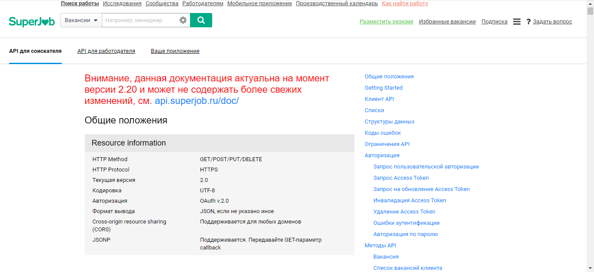
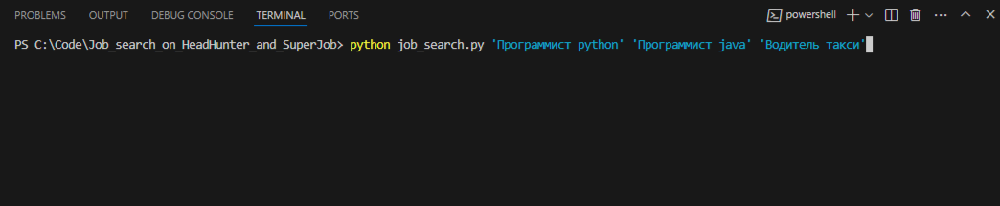
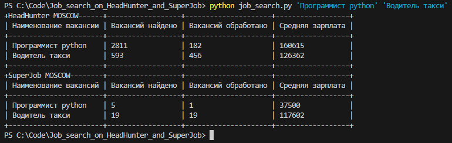

# Вывод таблицы, со статистикой вакансий, с сайтов HeadHunter и SuperJob
 
## Как установить

Python3 должен быть уже установлен. 
Затем используйте `pip` (или `pip3`, если есть конфликт с Python2) для установки зависимостей:
```
pip install -r requirements.txt
```

## Перед использованием

Вы должны зарегестрироваться на сайте SuperJob, далле перейти на сайт с документацией [API_SuperJob](https://api.superjob.ru/info/)

Добавить своё приложение во вкладке "Ваше приложение"


И дальше вы должны пройти авторизацию по инструкции указанной на сайте, во вкладке "API для соискателя"



После прохождения авторизации, вам надо создать файл с именем ``` .env ``` и добавить туда ``` SECRET_KEY_SUPER_JOB = 'Ваш ключ' ```

Ключ вы можете найти во вкладке "Ваше приложение"


## Пример использования

В командной строке вводите команду
```python
python job_search.py 'Профессия 1' 'Профессия 2' 'Профессия 3' ... 
```



После успешного срабатывания модуля, у вас отобразится таблица со статистикой



